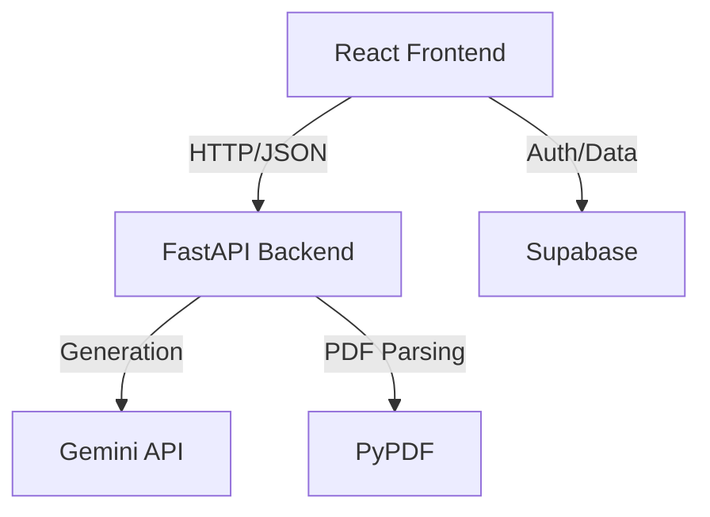

# Career Copilot: AI-Powered Job Application Tracker


## The Problem
Job hunting is chaotic. Applications are scattered across emails, resumes need constant tailoring to pass ATS filters, and interview preparation is often generic and unhelpful. Keeping track of everything while trying to stand out is a full-time job in itself.

## The Solution
**Career Copilot** is a full-stack SaaS platform designed to streamline your job search. It combines a drag-and-drop Kanban board for tracking applications with an AI-powered assistant that analyzes your resume against job descriptions and generates custom interview questions to help you land your dream job.

## Tech Stack


## Key Features

### 📊 Kanban Board
Visualize your job hunt status with an intuitive drag-and-drop board. Track applications from "Wishlist" to "Applied", "Interview", and "Offer".

### 🧠 AI Resume Matcher
Upload your PDF resume and a job description. Our Gemini-powered AI analyzes the match, provides a score (0-100), highlights missing keywords, and offers actionable advice to improve your chances.

### 🎯 Interview Simulator
Stop practicing with generic questions. Career Copilot generates custom Technical and Behavioral interview questions tailored specifically to the job description you are targeting. Includes an interactive "Safe Mode" to test your answers.

## Architecture



## Installation

### Frontend (React)
```bash
cd jobquest-saas
npm install
npm run dev
```

### Backend (FastAPI)
```bash
cd backend
pip install -r requirements.txt
uvicorn main:app --reload
```

## Security & Reliability
- **Strict JSON Enforcement**: Backend implements robust cleaning and retry logic to ensure AI responses are always valid JSON.
- **Circuit Breakers**: Fallback mechanisms prevent UI crashes even if the AI service experiences issues.

---
&copy; 2024 Career Copilot. Built with ❤️ and AI.
