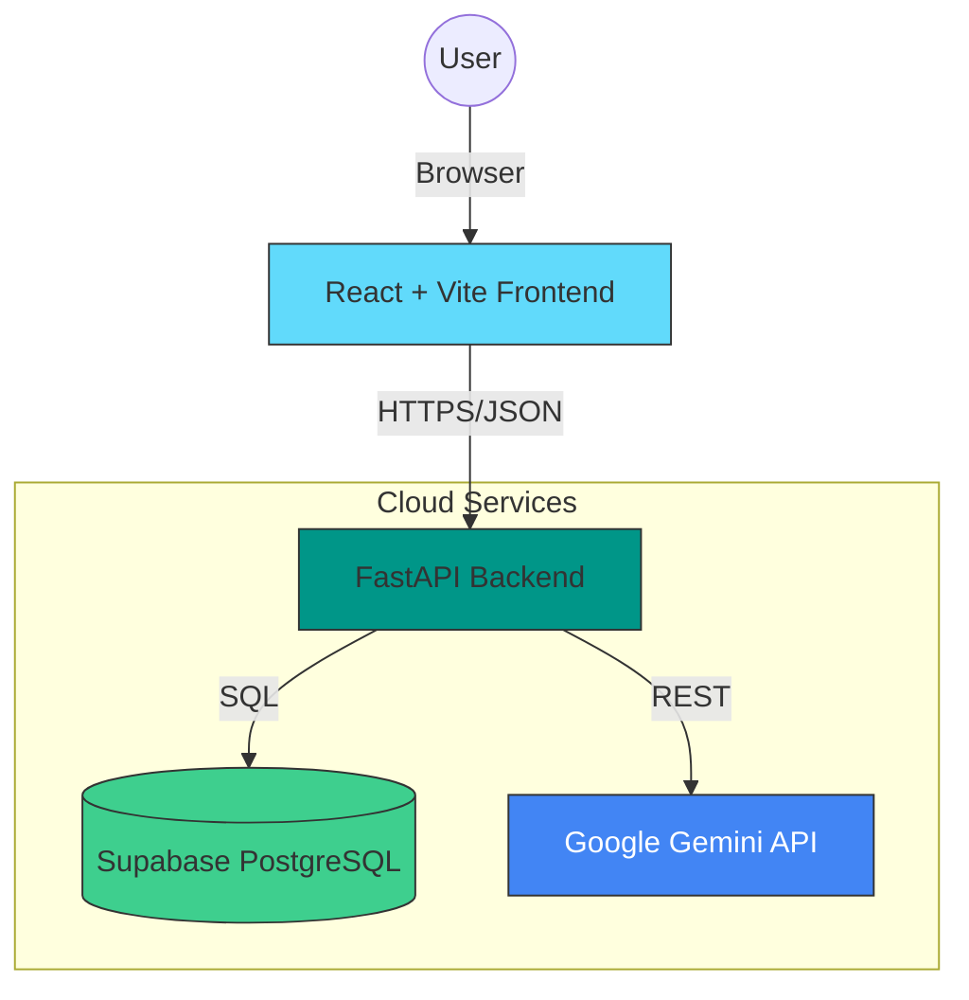

# 🚀 JobQuest SaaS
> **Your Intelligent Career Copilot.**
> Tracker for job applications powered by Generative AI to craft perfect cover letters and resume fixes.

[](https://jobquest-backend-ip8m.onrender.com)

---

## 🏗️ Architecture



## ✨ Key Features

- **🤖 AI Integration**: Leverages Google Gemini Pro to generate tailored cover letters and resume suggestions in seconds.
- **⚡ Real-time Database**: Built on Supabase for instant data synchronization and rigorous RLS security.
- **☁️ Cloud Deployment**: Fully orchestrated production environment hosted on Render (Frontend + Backend).

---

## 🛠️ Installation

### Prerequisites
- Node.js & npm
- Python 3.9+
- Git

### 1. Clone the Repository
```bash
git clone https://github.com/yourusername/jobquest-saas.git
cd jobquest-saas
```

### 2. Backend Setup
```bash
cd backend
python -m venv venv
# Windows
.\venv\Scripts\activate
# Mac/Linux
source venv/bin/activate

pip install -r requirements.txt
python -m uvicorn main:app --reload
```

### 3. Frontend Setup
```bash
# Open a new terminal
cd jobquest-saas
npm install
npm run dev
```
